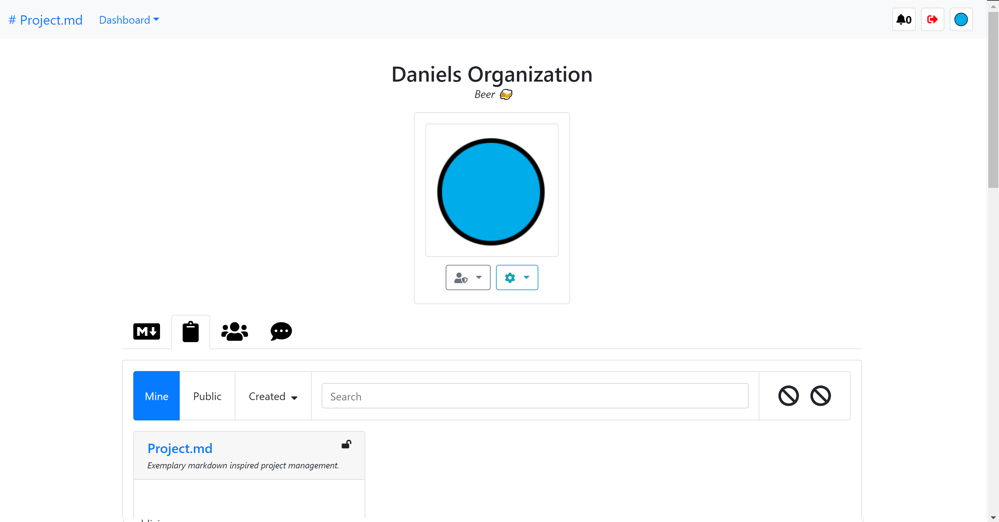

# Project.md
> Work in progress 👷‍♂️

📝 Exemplary markdown inspired project management built with; React, Node, GraphQL, MongoDB, Redis & Minio/S3.

# About
Tired of complicated project management systems? What something that speaks to the Markdown 🐱‍👤 inside of you? Project.md is designed with simplicity at its heart, letting you manage projects & present your ideas with pure Markdown. No longer shall you recursively search nested 'sub tasks' to oblivion.

# Tech Stack
> 🍻 To all the unmentioned technologies 

1. Server
    * Node.JS
    * Minio/S3
    * MongoDB
    * Redis
2. Client
    * React.JS

# Getting Started
Recommended to open `server` & `client` folders in separate instances of your editor. This will allow the `eslint` plugin's work correctly across both `server` & `client`.

> **Environment variables** copy `./.env.example` => `./.env` You may need to adjust variables to suit your setup.

## Server 
1. [MongoDB Server](https://www.mongodb.com/)
2. [Redis](https://redis.io/)
3. [Minio](https://min.io/)
4. `cd server`
5. `npm install`
6. `npm run start`

### Emails
This project uses [Nodemailer](https://nodemailer.com/about/) to send emails, you will need to adjust the config in either `./server/.env` or if you are using [Docker](#docker) adjust the variables in `./docker-compose.yml`.

```
EMAIL_HOST=smtp.ethereal.email
EMAIL_PORT=587
EMAIL_USER=testuser
EMAIL_PASSWORD=password
EMAIL_SECURE=true
EMAIL_FROM=no-reply@project-md.com
```

## Client 
1. `cd client`
2. `npm install`
3. `npm run start`

## Docker
> Use this to start client, server & dependencies all at once, take consideration for any conflicting services. Make sure you configure **email** config in docker.compose.yml 🐳

1. `docker-compose up`

### Docker Containers
> Use the following commands to setup the dependencies manually

#### MongoDB
```
$ docker run -d --publish 27017:27017 --name project-md-mongo mongo 
```

#### Redis
```
$ docker run -d --publish 6379:6379 --name project-md-redis redis
```

#### Minio/S3
```
$ docker run -d --publish 9000:9000 --name project-md-minio -e MINIO_ACCESS_KEY=accesskey -e MINIO_SECRET_KEY=secretkey minio/minio server /data
```

# Screenshots
> Demo coming soon, style is work in progress 🏗

## Organization


## Project


## Profile

